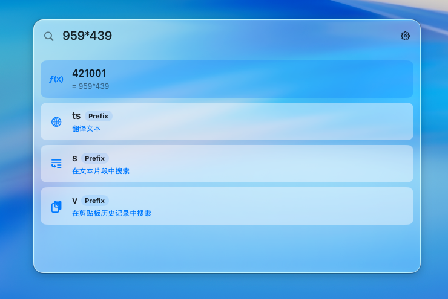
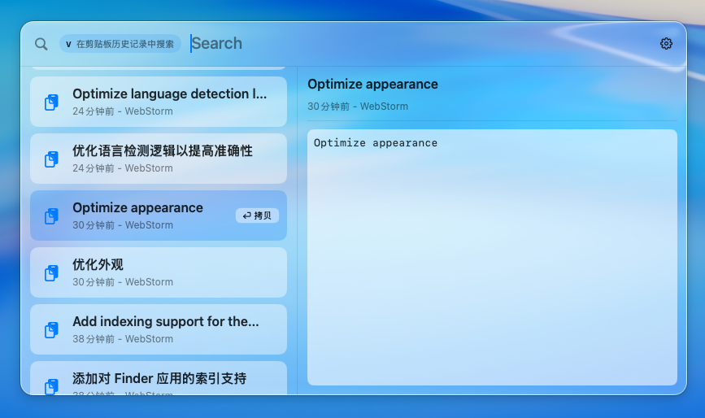
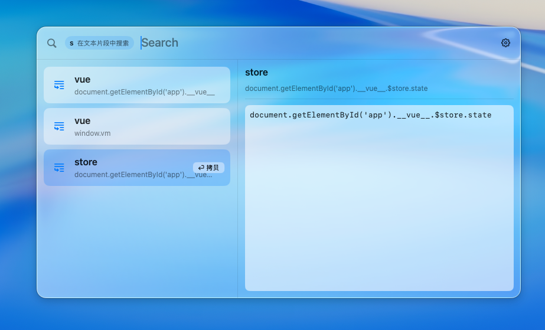
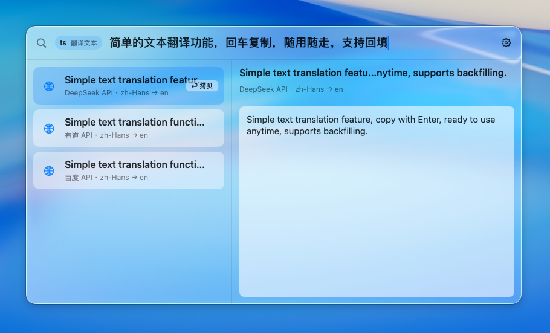

# FocusLite

一款轻量级的类聚焦搜索体验的效率启动器。

## 安装

1. 进入[releases](https://github.com/PeixinLu/FocusLite/releases)页，选择最新的版本，下载`FocusLite.zip`
2. 双击`FocusLite.zip`解压，会获得一个 `FocusLite.app` 文件
3. 将`FocusLite.app` 移动到 `/Applications` 或 `/应用程序` 目录下，双击运行
4. 启动后将在菜单栏看到图标
   
5. 默认通过 `⌥ + 空格` 唤起启动器，可在设置中配置

## 常见问题

### 1. 提示“app已损坏”

    在终端中输入：`xattr -cr /Applications/FocusLite.app` 回车
    再次运行app即可

## License

MIT License. See `LICENSE`.

## 主要界面


## ✨ 核心特性

支持最新的液态玻璃效果（需更新至 macOS 26）支持丰富的外观配置项


### 🚀 应用启动
- **智能搜索**：支持应用名称、拼音首字母、模糊匹配
- **快速启动**：输入即搜，回车即开
- **Spotlight 替代**：更轻量、更快速的应用启动体验


### 🧮 计算器
- **即时计算**：输入数学表达式立即得到结果
- **无需前缀**：直接输入 `2+2`、`100*0.15` 等即可计算
- **支持复杂运算**：括号、小数、百分比等



### 📋 剪贴板历史
- **智能记录**：自动保存复制历史，支持文本、图片、文件
- **快速呼出**：`Option+V` 快捷键唤起剪贴板面板
- **可视化预览**：右侧实时预览剪贴板内容
- **灵活配置**：可设置保存时长（3小时到1周）、忽略应用、最大条目数
- **智能搜索**：支持全文搜索历史记录



### 📝 代码片段
- **快速插入**：`;关键词` 触发代码片段（如 `;addr` 插入地址）
- **自动粘贴**：可配置自动粘贴到前台应用
- **可视化管理**：通过独立窗口新增、编辑、删除片段
- **灵活分类**：自定义触发前缀和关键词



### 🌐 多服务翻译
- **多引擎支持**：有道、百度、Google、微软、DeepSeek
- **智能识别**：自动检测中英文，双向翻译
- **实时结果**：多个翻译服务同时返回结果
- **一键操作**：回车复制或自动粘贴翻译结果
- **触发方式**：输入 `tr` 后接待翻译文本



### ⚡ 全局快捷键
- **Cmd+Space**：全局唤起/隐藏启动器（需禁用系统 Spotlight）或者改成 `⌥ + 空格`
- **Option+V**：快速打开剪贴板历史
- **Esc**：隐藏启动器窗口
- **菜单栏图标**：点击快速切换或退出应用

## 💻 快速开始

### 系统要求
- macOS 13 及以上版本
- Xcode 15+ （Swift 5.9）

### 首次使用
1. **设置快捷键**：如需使用 Cmd+Space，请先在「系统设置 > 键盘 > 键盘快捷键 > Spotlight」中禁用系统 Spotlight
2. **授予权限**：如需使用自动粘贴功能，需要在首次使用时授予辅助功能权限
3. **配置翻译**：如需使用翻译功能，请在菜单栏「翻译设置」中配置 API 密钥

---

## 📚 使用指南

### 🔍 应用搜索

**基本搜索**
- 直接输入应用名称：`Safari`、`微信`
- 支持拼音：`wx` 可搜索到微信
- 支持首字母：`vsc` 可搜索到 Visual Studio Code
- 模糊匹配：`pho` 可搜索到 Photoshop

**操作**
- ↑↓ 键选择应用
- 回车键启动选中的应用
- Esc 关闭启动器

---

### 🧮 计算器

**支持的运算**
- 基本运算：`2+2`、`10-3`、`5*6`、`100/4`
- 括号运算：`(2+3)*4`
- 小数运算：`3.14*2`
- 百分比：`100*15%`

**操作**
- 直接输入表达式，自动计算
- 回车复制结果到剪贴板

---

### 📋 剪贴板管理

**快速使用**
1. 按 `Option+V` 唤起剪贴板历史
2. 输入关键词搜索历史记录
3. 或使用 `c ` 前缀在主界面搜索：`c hello`
4. 回车复制选中内容

**高级功能**
- **内容预览**：右侧面板实时预览文本、图片、文件
- **多类型支持**：文本、图片、文件路径
- **智能过滤**：可配置忽略特定应用
- **定时清理**：设置保存时长（3小时/12小时/1天/3天/1周）

**设置选项**
- 在菜单栏点击「剪贴板设置」进入配置
- 可调整：保存数量、快捷键、忽略应用、保存时长
- 数据存储位置：`~/Library/Application Support/FocusLite/clipboard_history.json`

---

### 📝 代码片段

**快速使用**
1. 输入 `;` 后跟关键词，如 `;email` 、`;addr`
2. 选择匹配的片段
3. 回车自动粘贴到前台应用（或复制到剪贴板）

**管理片段**
1. 点击启动器窗口右上角的铅笔图标
2. 在管理窗口中新增、编辑、删除片段
3. 设置关键词和片段内容

**应用场景**
- 常用邮箱地址
- 常用代码模板
- 快捷短语
- 联系信息

**配置**
- 数据存储：`~/Library/Application Support/FocusLite/snippets.json`
- 可自定义触发前缀（默认 `;`）

---

### 🌐 翻译功能

**使用方法**
1. 输入 `tr` 后跟空格，再输入待翻译文本
2. 例如：`tr hello`、`tr 你好`
3. 等待多个翻译服务返回结果
4. 回车复制或自动粘贴翻译结果

**支持的翻译服务**
- 有道 API
- 百度 API
- Google Cloud Translation API
- 微软翻译 API
- DeepSeek API

**配置方法**
1. 点击菜单栏图标，选择「翻译设置...」
2. 启用需要的翻译服务
3. 输入相应的 API 密钥和配置
4. 测试连接确认配置正确

**智能特性**
- 自动检测语言：中文→英文，英文→中文
- 多服务并发：同时请求多个翻译服务
- 结果排序：按配置的服务顺序显示

---

## ⚙️ 设置与配置

### 快捷键设置

**主快捷键 (Cmd+Space)**
- 默认使用 Cmd+Space 唤起启动器
- 如果不生效，需要先禁用系统 Spotlight：
  - 打开「系统设置 > 键盘 > 键盘快捷键 > Spotlight」
  - 取消勾选 Spotlight 的快捷键
- 也可通过菜单栏图标点击唤起

**剪贴板快捷键**
- 默认：`Option+V`
- 可在剪贴板设置中自定义

### 权限管理

**辅助功能权限 (Accessibility)**
- 用途：实现代码片段自动粘贴功能
- 何时需要：首次使用自动粘贴时系统会弹窗提示
- 如何启用：「系统设置 > 隐私与安全 > 辅助功能」中添加 FocusLite
- 如拒绝：仅复制到剪贴板，不影响其他功能

**不需要的权限**
- 输入监控 (Input Monitoring)：✘️ 不需要
- 屏幕录制 (Screen Recording)：✘️ 不需要
- 剪贴板读取：✅ 无需授权（macOS 原生支持）

### 数据存储

FocusLite 将数据存储在用户目录下：
```
~/Library/Application Support/FocusLite/
├── clipboard_history.json  # 剪贴板历史
└── snippets.json           # 代码片段
```

---

## ❓ 常见问题

### 快捷键问题

**Q：Cmd+Space 没有反应？**
A：系统 Spotlight 仍然占用该快捷键。请在「系统设置 > 键盘 > 键盘快捷键 > Spotlight」中禁用，或使用菜单栏图标唤起。

**Q：快捷键注册失败？**
A：使用菜单栏图标切换窗口，或检查是否有其他应用占用该快捷键。

### 输入问题

**Q：窗口显示但无法输入？**
A：
1. 在窗口内点击一次获取焦点
2. 或者重启应用
3. 如问题持续，请提交 issue 并附上 macOS 版本信息

### 翻译问题

**Q：翻译功能不工作？**
A：
1. 检查是否配置了 API 密钥
2. 在翻译设置中点击“测试连接”
3. 确认网络连接正常
4. 查看 API 配额是否耗尽

### 剪贴板问题

**Q：剪贴板历史没有记录？**
A：
1. 检查剪贴板功能是否开启
2. 查看当前应用是否在忽略列表中
3. 某些应用使用私有剪贴板，可能无法捕获

**Q：图片或文件无法预览？**
A：确认文件仍然存在且未被移动。剪贴板仅存储文件路径，不复制文件内容。

### 权限问题

**Q：自动粘贴不工作？**
A：
1. 检查是否授予辅助功能权限
2. 在「系统设置 > 隐私与安全 > 辅助功能」中添加 FocusLite
3. 授权后重启应用

---

## 🛠️ 开发者指南

### 技术栈
- **语言**：Swift 5.9+
- **UI 框架**：SwiftUI + AppKit
- **构建工具**：Xcode 15+
- **自动更新**：Sparkle 2
- **CI/CD**：GitHub Actions

### 项目结构
```
FocusLite/
├── FocusLite/              # 主应用
│   ├── LauncherView.swift  # 启动器界面
│   ├── SettingsView.swift  # 设置面板
│   └── ...                 
├── FocusLiteCore/         # 核心逻辑
│   ├── Search/            # 搜索框架
│   └── Preferences/       # 偏好设置
├── FocusLitePlugins/      # 功能插件
│   ├── AppSearch/         # 应用搜索
│   ├── Calc/              # 计算器
│   ├── Clipboard/         # 剪贴板
│   ├── Snippets/          # 代码片段
│   └── Translate/         # 翻译
└── FocusLiteTests/        # 单元测试
```

## 📝 许可证

此项目仅供学习和交流使用。

---

## 👏 贡献

欢迎提交 Issue 和 Pull Request！

---

## 📞 交流反馈

qq群：1070327833
